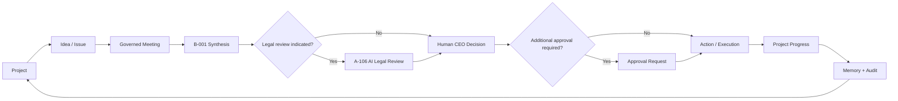
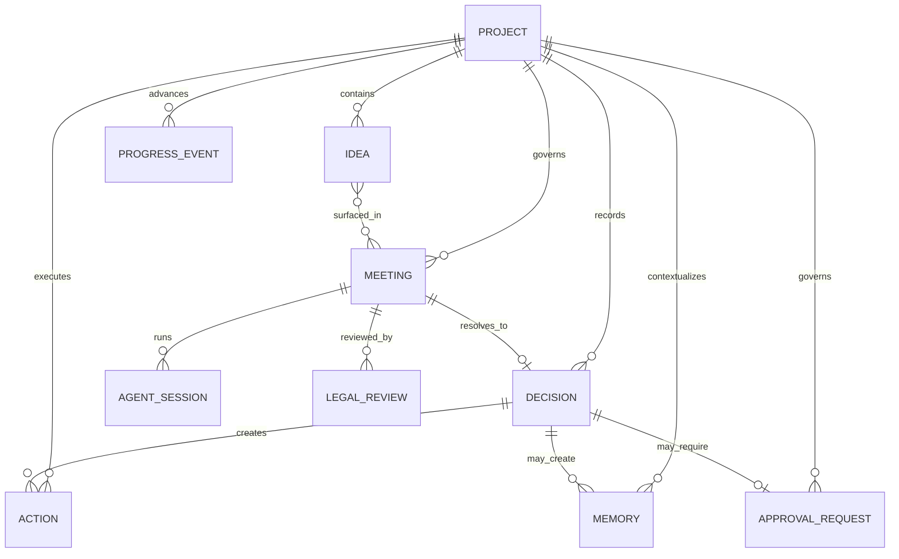
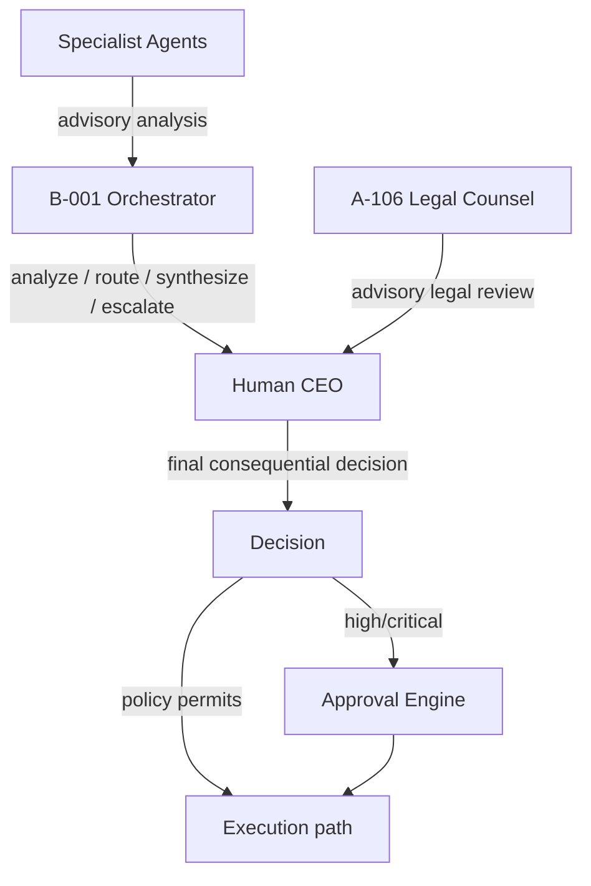
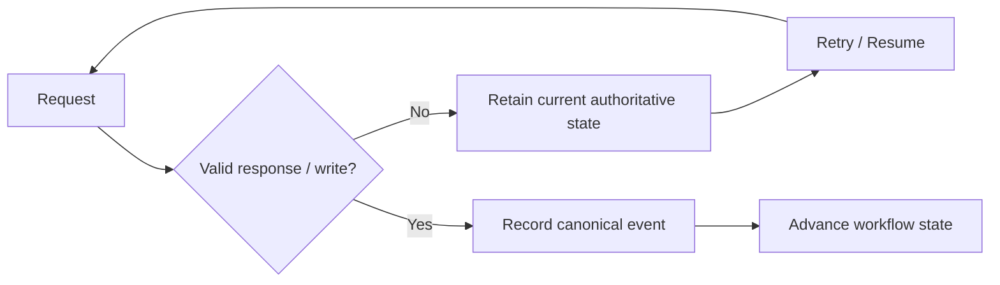

# WF-001 — Workflow Architecture Diagrams

These diagrams are the visual companion to `WF-001_UNIFIED_WORKFLOW_ARCHITECTURE.md`.

## 1. Governed operating loop



## 2. Entity relationship view



## 3. Authority boundary



## 4. Failure-safe progression



## 5. Lifecycle boundaries

```text
Project:      draft → active → blocked/on_hold → completed → archived
Idea:         inbox → triaged → research/scheduled/deferred → accepted/rejected → archived
Meeting:      draft → scheduled → running → completed → archived/cancelled
Decision:     proposed → pending_human → pending_approval → approved/rejected → superseded
Action:       planned → ready → in_progress → blocked → completed/cancelled
Legal Review: requested → running → completed/failed
Memory:       draft → approved → archived
```

## 6. Navigation contract

```text
Project
 ├─ Ideas
 ├─ Meetings
 ├─ Decisions
 ├─ Legal Reviews
 ├─ Approvals
 ├─ Actions
 ├─ Memory
 └─ Timeline / Progress

Meeting
 ├─ Related Project
 ├─ Related Idea(s)
 ├─ Agent Session
 ├─ Legal Review(s)
 ├─ Human CEO Decision
 └─ Resulting Action(s)

Decision
 ├─ Related Project
 ├─ Source Meeting
 ├─ Approval Request
 ├─ Actions
 └─ Memory
```
