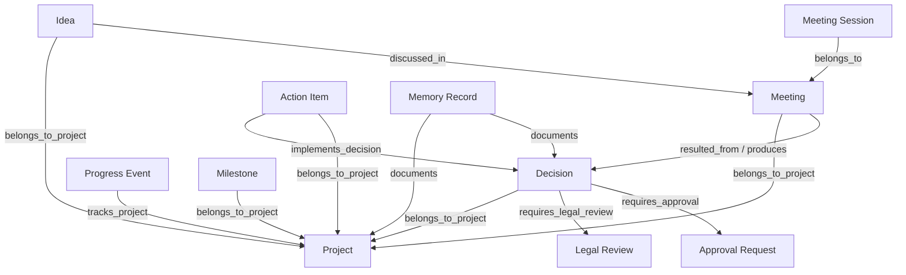

# WF-003 — Entity Relationship Engine

Status: Canonical architecture for Batch 2.1
Scope: RYTHM Company OS MVP v1.0
Depends on: WF-001, WF-002

## Purpose

The Entity Relationship Engine defines how governed RYTHM objects are connected so a project can be operated as one coherent graph rather than a collection of isolated screens. It provides a canonical relationship vocabulary, provenance rules, navigation rules, and integrity constraints for Projects, Ideas, Meetings, Decisions, Legal Reviews, Approvals, Actions, Memory, Agent Runs, and Progress records.

## Architectural rule

Existing first-class foreign keys remain the preferred relationship mechanism where a direct semantic relationship already exists. The relationship engine does **not** replace strong relational columns with a generic graph table.

A generic relationship record is used only when:
- the relationship is cross-domain and not represented by a safe direct FK;
- multiple relation types may exist between the same entities;
- provenance/navigation need an explicit semantic edge;
- a future entity should join the operating graph without destructive schema rewrites.

## Canonical entity types

- `project`
- `idea`
- `meeting`
- `meeting_session`
- `decision`
- `legal_review`
- `approval_request`
- `action_item`
- `memory_record`
- `project_milestone`
- `project_progress_event`
- `agent_run`
- `agent`

New entity types require architecture review before joining the canonical graph.

## Canonical relationship types

### Project containment
- `belongs_to_project`
- `tracks_project`
- `supports_project`

### Origin / provenance
- `originated_from`
- `derived_from`
- `proposed_by`
- `resulted_from`

### Governance
- `requires_approval`
- `approved_by`
- `requires_legal_review`
- `reviewed_by_legal`
- `governs`

### Execution
- `implements_decision`
- `depends_on_action`
- `blocks`
- `unblocks`
- `produces_evidence_for`

### Knowledge
- `documented_by_memory`
- `supersedes`
- `references`

### Meeting
- `discussed_in`
- `synthesized_in`
- `decided_in`

## Canonical MVP relationship graph

## Direct FK relationships already preferred

The current schema already contains direct relationships such as:
- `action_items.meeting_id → meetings.id`
- `action_items.decision_id → decisions.id`
- project integration columns added by Project Workspace for governed entities
- legal review/session relationships introduced by the Meeting and Legal Review engines
- `company_memory.supersedes_id → company_memory.id`

Those remain authoritative. A generic edge may mirror their semantic meaning for navigation/provenance only if it is created atomically and cannot contradict the direct FK.

## Proposed generic edge contract

When Step 2.1.6 implements persistence, the logical edge requires:

| Field | Purpose |
|---|---|
| id | Unique edge ID |
| organization_id | Tenant boundary |
| project_id | Optional project scope for efficient graph retrieval |
| source_type | Canonical source entity type |
| source_id | Source UUID |
| relationship_type | Canonical semantic relation |
| target_type | Canonical target entity type |
| target_id | Target UUID |
| created_by_user_id | Human provenance |
| created_by_agent_id | Agent provenance |
| source_event_id | Workflow event that established the edge when available |
| metadata | Minimal relation metadata |
| created_at | Immutable creation time |

The canonical uniqueness key should prevent duplicate identical edges:

`organization_id + source_type + source_id + relationship_type + target_type + target_id`

## Directionality

Relationships are stored in one canonical direction. Reverse navigation is queried, not duplicated.

Example:
- store `action_item implements_decision decision`
- do not also store a second `decision implemented_by action_item` edge.

UI labels may render reverse-language labels while preserving one underlying edge.

## Integrity rules

1. Source and target must belong to the same organization unless a future explicit cross-org contract is approved.
2. Project-scoped relationships must not connect records from conflicting projects.
3. A relationship cannot create authority. Linking an agent to a decision does not authorize that agent to approve it.
4. CEO decisions, approvals, legal requirements, and external-action restrictions remain enforced by their domain engines.
5. Relationship creation is auditable and event-backed where consequential.
6. Deleting a source entity must not silently destroy legally/audit-significant provenance. Archived/tombstoned semantics are preferred for governed history.
7. Relationship writes must be idempotent.
8. Generic edges may not contradict authoritative FKs.

## Project graph retrieval

The backend should expose one project operating graph assembled from:
- direct project-scoped records;
- direct FK relationships;
- semantic relationship edges;
- workflow events for chronology.

The graph response should group nodes by entity type and include only navigation-safe summary fields. Full entity details remain owned by their domain routes/tables.

## Navigation contract

Each governed detail surface should be able to expose contextual links where records exist:

### Project
Ideas, Meetings, Decisions, Legal Reviews, Approvals, Actions, Memory, Progress.

### Meeting
Related Project, source Idea/Issue, Legal Review, Decision, resulting Actions.

### Decision
Related Project, source Meeting, Legal Review, Approval, implementing Actions, linked Memory.

### Action
Related Project, source Decision/Meeting, dependencies, evidence/memory.

### Memory
Related Project and originating Decision/Meeting/Action when known.

Navigation is contextual discovery, not an authorization bypass; every destination independently enforces RLS/authorization.

## Relationship creation sources

Edges may be produced by:
- explicit Human CEO action;
- governed backend command;
- deterministic system derivation from authoritative FKs;
- governed agent proposal that is accepted by the relevant domain workflow.

Agents must not create consequential semantic links that imply approval/authorization without the required Human CEO gate.

## Interaction with WF-002

A relationship-changing transaction emits a workflow event when the relationship is operationally meaningful. Typical events include:
- `idea.idea.routed`
- `meeting.meeting.created`
- `governance.decision.recorded`
- `legal.review.requested`
- `governance.approval.requested`
- `execution.action.created`
- `memory.record.approved`

The event provides chronology; the relationship edge provides durable graph semantics.

## Query and performance rules

The persisted engine should index:
- organization/project
- source type + source id
- target type + target id
- relationship type

Project graph retrieval must avoid unbounded recursive traversal in the MVP. The default graph depth is one semantic hop plus explicitly requested related groups.

## Security

- All edges are organization-scoped.
- RLS member-read / owner-or-authorized-write follows the same policy family as governed objects.
- Service-role usage remains server-only.
- Relationship metadata must not contain secrets.
- Cross-organization edges are prohibited in MVP.

## Implementation boundary

WF-003 defines graph semantics and integrity. The generic edge table, RLS policies, backend helpers, reconciliation with existing FKs, and project-graph query layer belong to Step 2.1.6. Contextual navigation UI belongs to Step 2.1.7.