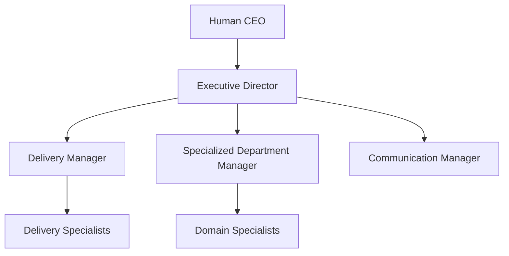
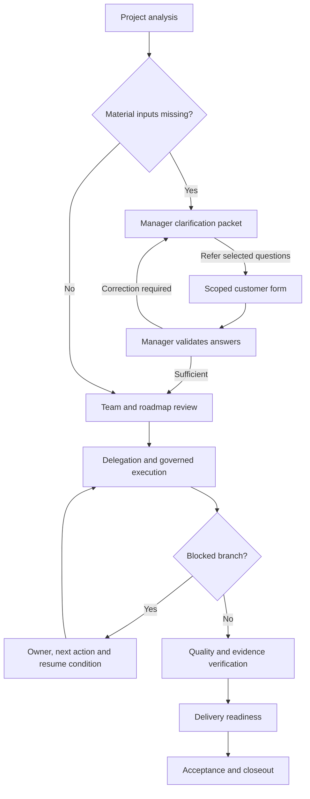

# Shared company operating core v1

This change extends the existing Project OS, V2 worker, Integration & Execution Gateway, completion evaluator, company knowledge retrieval and tenant email transport. It does not introduce a template-specific engine.

## Verified inventory (2026-10-03)

- Source/production commit: cbc12994aceb44e3acc255a448b18130ce4221a9.
- Vercel project: prj_zDgN04lvSuAEzkLr5MzQSohmwYoB. Production deployment dpl_CQ8aNg9WKdbGrHAWoFPxtGJjBC9s was READY.
- Supabase project: dezbacyuvsdrlpmmpjht, Rythm-company-os.
- Software and Web Development are distinct catalog templates; both use the software family contract. Advertising uses the advertising contract. Unknown/future templates inherit the shared general contract.
- Only Advertising had a recorded installation in the current production inventory. Existing RYTHM also contains advertising/software specialists; ownership backfill covers every company without guessing an unrecorded installation.
- All 19 department manager fields were empty. Enabled/paused contradictions existed.
- Airolepath SEO has no project connection bindings and no implementation/verification progress.
- 15 approved proposals had historical no_external_action results. These require an explicit manager intent decision and evidence, not automatic external replay.
- The production scheduler is enabled with a five-minute cadence targeting https://rythm-os.com. No isolated Supabase development branch was available.
- Two email drafts were ready for delivery; no sent message was observed. Auto-send was disabled.

## Contract and deterministic boundaries

Template configuration lives in company_operating_template_contracts, versioned with the shared core. It contains required roles, intake themes, deliverables, evidence, acceptance and specialized playbooks. Company ownership, clarification, delegation, spending, execution classification and recovery use common services.

The Executive Director is reused where an Executive Orchestrator/COO already exists; otherwise an internal Executive Director agent is created with no external-action authority and no claim of professional certification. Existing specialist identities remain intact. New directors bind the existing active Executive Orchestrator & AI Chief of Staff catalog foundation when available; runtime retrieves it through the same permitted knowledge loader. This is evidence-backed knowledge reuse, not a competence certification. Qualified existing department managers are linked; the Executive Director acts as interim manager where no existing manager is identifiable. Explicit pauses remain pauses. The scheduler and runtime both refuse paused/foreign agents.

The project flow is separate from organizational authority:

Planning blocks only unresolved required intake/planning questions. Later-stage questions do not stop independent planning. Customer answers remain source evidence until manager validation. Customer consent must match the latest submitted source response. Nonessential waivers require justification; required consent cannot be waived. Historical answers are provided to analysis and roadmap generation.

Initial planning continues through a leased scheduler job once the manager resolves required planning gaps. It uses the existing roadmap planner and AI cost gateway, retries at most three times, and respects explicit pauses and existing executions. Nonterminal tasks retain continuity obligations even when an execution batch ends. Overdue obligations are marked without extra AI calls.

Customer links contain random 256-bit tokens; only hashes are stored in the form table. Access expires in seven days and is revocable. Question payloads use an explicit allowlist excluding internal reasons, cost and notes. Draft/submission writes are serialized with revision checks. Uploads are private in the project-files bucket, scoped to organization/project/form, with size/type/magic checks. Correction rounds preserve prior answers and scoped uploads across rounds. Bearer-token URLs are excluded from analytics and public attribution. Email creation is a pending-approval draft linked to the project; it never sends during development. The existing tenant mail transport handles actual delivery.

Proposal translation is leased across overlapping dispatchers. Once scoped action payloads are persisted, retries reuse their exact order and idempotency keys. Missing access and ambiguous intent remain remediation/review states. Only a recorded internal-only manager decision permits no_external_action.

Spending uses distinct media/service/third-party/internal accounts with currency and period. Zero authorization is the default. Approximate ranges do not authorize spending. Reservation locks serialize concurrency and idempotency. Project financial gateway actions require an account and explicit maximum cost; threshold decisions remain approval-gated. An uncertain provider charge retains its full reservation until a receipt reconciles it. No currency conversion is invented. Existing AI wallet/gateway cost enforcement remains authoritative for model calls; new internal accounts are not yet synchronized to that ledger.

The shared delegation validator rejects missing/ambiguous dependencies, cycles and unavailable/foreign owners. V2 runtime receives persisted actual predecessor outputs plus role instructions and permitted company/professional knowledge. Follow-up reservation and approval creation are one database transaction. New scope requires review; the worker does not authorize its own suggestions. Follow-up depth and fan-out are bounded.

Rejections record cost/approach/evidence/revision/definitive constraints for all project approval subjects. Definitive branches remain closed. Conditional approvals remain held pending manager validation. Recovery obligations do not themselves prove an alternative has been executed. Existing completion/evidence/observation/acceptance gates are reused.

Synthetic executive evaluations cover budget, definitive repeated rejection, missing customer inputs, uncertain failed execution and competing priorities. These are callable through the owner-only evaluation endpoint and are persisted. Passing structural tests or providing an MBA-domain prompt does not establish MBA-equivalent competence.

## Release limitations / remaining engineering

This is an implementation tranche, not a completion claim for the full requested architecture.

Before production release, finish and verify:

1. Full browser flow tests of both templates, form correction/uploads, manager decisions and independently verified delivery readiness.
3. Live roadmap revisions that append changed scope while preserving active unaffected branches. Current code refuses replacing an active baseline rather than cancelling/replaying it.
4. Full substantive inbound customer-reply interpretation and executable communication follow-ups; acknowledgment drafts alone are insufficient.
5. Explicit recurring contractual cycles, cycle-specific evidence/acceptance/closeout. Existing bounded observation/closeout gates do not yet implement the requested recurring-service cycle model.
6. Complete localization of customer form UI and email body. Language metadata and supplied question wording are preserved; chrome is currently English.
7. Provider cost receipts and mapping the separate internal account model to the existing AI/infrastructure cost ledger.
8. Full reconciliation for non-task blockers and observation periods, including capacity assignments for director revision work. Task obligations and overdue status are now reconciled deterministically.
9. Runtime tests of all rejection subjects, expiry/cancellation, conditional approval release and revised alternatives. Current source/static and synthetic tests are not full provider execution proof.
10. Template contract schema validation, material-change diffing and deterministic agent qualification beyond membership/availability.

Human/external dependencies: project-scoped repository/site/campaign/analytics targets; permitted capabilities; customer contact plus an active outbound mailbox; actual sending authority; customer consent/acceptance; explicit spending ceiling/currency/period; authorized provider cost receipts. No credentials are copied from other companies.
